# AI Helpdesk Copilot

An AI-assisted internal helpdesk platform built to help support teams triage tickets faster, surface the right context sooner, and keep AI recommendations reviewable, measurable, and safe.

This is not just a ticket CRUD app. It is a workflow product that combines operational ticket handling with an AI copilot layer, grounded support guidance, human review controls, feedback capture, and dashboard-level AI analytics.

---

## Overview

Support teams often lose time on the same problems:

* long tickets take too long to understand
* triage quality varies from one agent to another
* support knowledge lives in scattered notes and tribal memory
* customer replies are inconsistent in tone and quality
* AI can help, but only if it is transparent, reviewable, and measurable

**AI Helpdesk Copilot** was built to address that gap.

It provides a complete support workflow with:

* ticket queue management
* assignment and status lifecycle
* comments and audit timeline
* AI-assisted category, priority, and team suggestion
* AI-generated summaries and draft replies
* confidence-aware UI behavior
* provider/source transparency
* grounded resolution help from internal knowledge
* similar-ticket surfacing
* ticket history summarization
* rewrite tools for agent productivity
* feedback capture for AI governance
* dashboard analytics for AI usage and outcomes

---

## Why this project is different

Most portfolio helpdesk apps stop at:

* create ticket
* update ticket
* assign ticket
* close ticket

This project goes further.

It treats support as an operational workflow and AI as a governed layer inside that workflow.

That means the system does not just generate AI outputs. It also:

* shows where the output came from
* indicates confidence
* allows human accept/reject decisions
* degrades safely with fallback behavior
* stores feedback events
* measures AI usage and performance over time

That is the difference between adding AI for show and designing AI as part of a real product.

---

## Key capabilities

## 1. Support operations core

The app includes the foundation expected from a real internal helpdesk tool:

* ticket creation
* ticket queue with search and filters
* status lifecycle management
* team assignment
* agent assignment
* ticket comments
* event timeline and audit trail
* dashboard overview
* recent activity feed

This gives the product a real operational backbone before AI is introduced.

---

## 2. AI-assisted triage

The AI layer helps agents by generating:

* predicted category
* predicted priority
* suggested team
* ticket summary
* draft customer reply

The goal is to shorten the time between ticket intake and first meaningful action.

Instead of manually reading every ticket from scratch, agents can start with a structured recommendation and review it quickly.

---

## 3. Source transparency and confidence-aware behavior

One of the core product decisions in this project is that AI is never treated as a black box.

Every recommendation can expose its source, such as:

* OpenAI
* Ollama
* rule engine
* rule fallback

The UI also surfaces a confidence signal so that recommendations can be treated differently depending on certainty.

This makes the system more trustworthy, easier to debug, and safer to use in day-to-day support operations.

---

## 4. Knowledge-grounded resolution help

The AI layer is complemented by grounded support intelligence.

For each ticket, the system can surface:

* matched internal guidance
* recommended checks
* escalation guidance
* relevant support articles

This reduces the risk of treating LLM output as the only source of truth and makes the product feel closer to a real support copilot than a generic chatbot wrapper.

---

## 5. Similar-ticket discovery

The ticket detail view can surface similar historical tickets based on:

* category overlap
* team overlap
* shared terms
* heuristic similarity scoring

This helps agents quickly understand whether the issue has appeared before and what prior resolution paths may be relevant.

---

## 6. Ticket history summarization

Support tickets often become long and fragmented over time.

To reduce handoff friction, the product generates a structured history summary that can include:

* current state
* what happened so far
* latest meaningful update
* blockers and risks
* next recommended step

This is especially useful when a ticket is reassigned or picked up by a different agent later in the workflow.

---

## 7. Agent rewrite tools

Agents can transform AI-generated draft replies into variants better suited for specific contexts.

Supported rewrite modes include:

* **Shorter**
* **More Formal**
* **More Empathetic**
* **Customer-Safe**

These tools improve day-to-day usability by helping agents adapt communication style without rewriting from scratch.

---

## 8. Safe fallback behavior

AI systems fail in real life.

This project was designed with degraded-mode behavior in mind:

* provider switching is supported
* local model output can be validated
* poor rewrite output can be rejected
* rule-based fallback keeps the workflow usable

That means the system remains functional even when a model is unavailable, misconfigured, or returns poor output.

---

## 9. Feedback capture and AI governance

The app records how humans interact with AI outputs.

Examples of captured events include:

* review decisions such as accept or reject
* rewrite usage
* rewrite mode used
* source of the AI output
* timestamps tied to the ticket lifecycle

This creates a real audit trail for AI behavior and opens the door to future evaluation and retraining workflows.

---

## 10. AI analytics on the dashboard

The dashboard does not just show ticket metrics. It also shows AI metrics.

Examples include:

* total analyses
* accepted recommendations
* rejected recommendations
* rewrite usage count
* fallback analysis count
* acceptance rate

This gives the product a strong operations-and-governance story: AI is not just present, it is measurable.

---

## Product walkthrough

## Dashboard

The dashboard gives a quick operational overview of the helpdesk system.

It includes:

* total tickets
* open tickets
* in-progress tickets
* AI-analyzed ticket count
* status breakdown
* recent workflow activity
* AI analytics panel

This makes it useful both for agents and for leads who want visibility into support flow and AI usage.

---

## Ticket queue

The ticket queue is built for speed and clarity.

It supports:

* search
* workflow filters
* sorting
* assignment visibility
* team visibility
* readable title hierarchy
* fast entry into ticket detail

This is where the app moves from demo territory into something that feels like a real internal operations tool.

---

## Ticket detail workspace

The ticket detail page is the core working surface of the product.

It brings together:

* ticket summary and metadata
* AI copilot panel
* knowledge-grounded resolution help
* ticket history summary
* feedback capture
* ticket actions
* similar tickets
* comments
* full event timeline

This page is where the product story becomes strongest because it shows the operational workflow and the AI workflow side by side.

---

## Screenshots

### Dashboard Overview
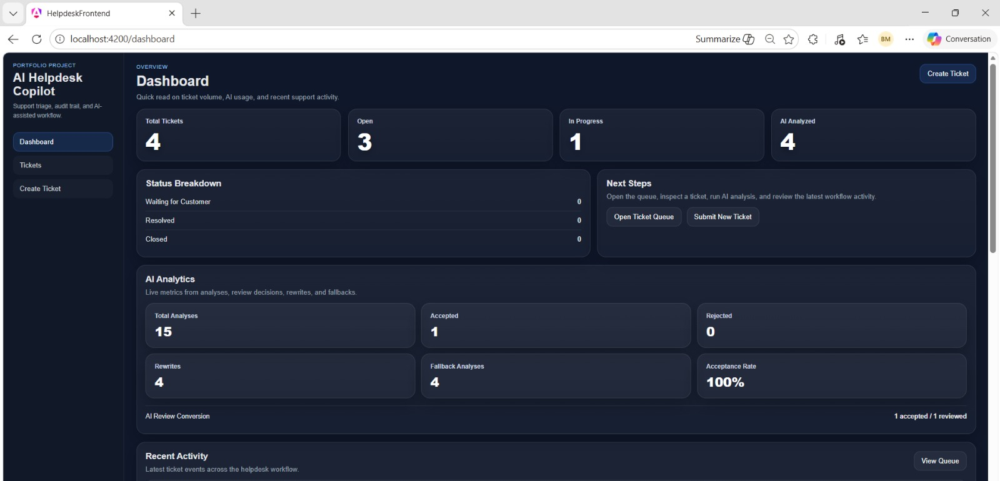

### Dashboard Recent Activity
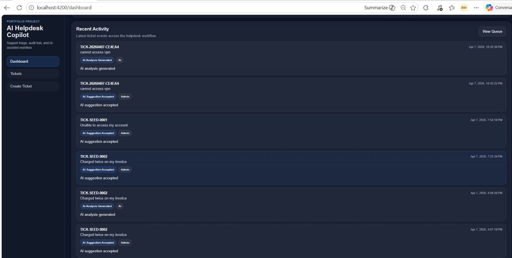

### Ticket Queue
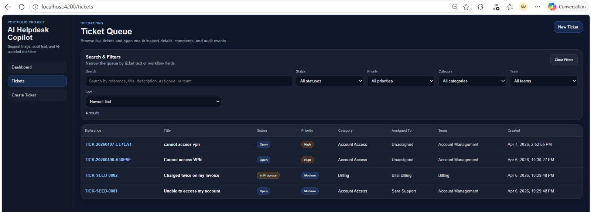

### Create Ticket
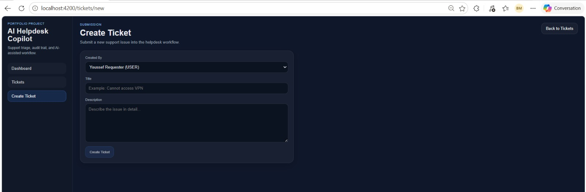

### Ticket Detail Overview
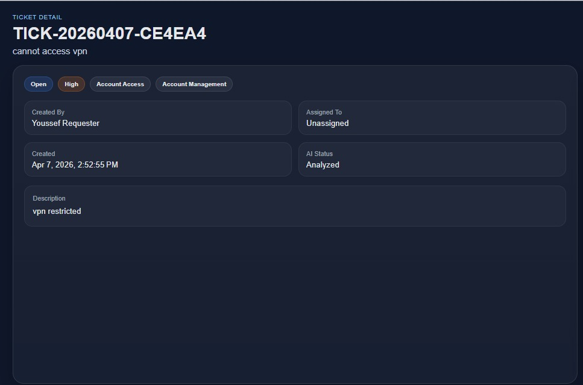

### AI Copilot Panel
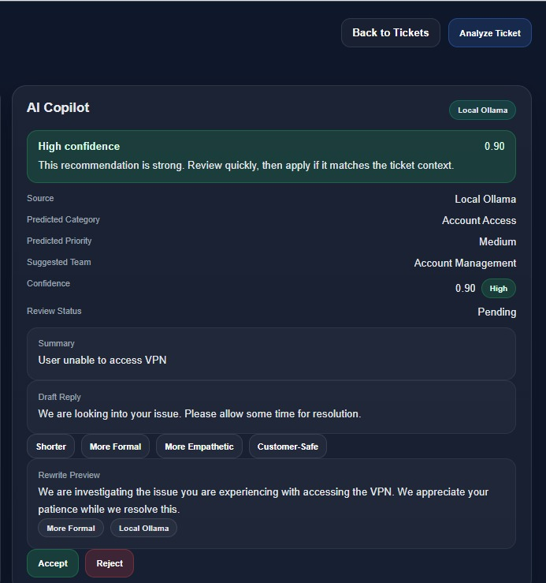

### Knowledge-Grounded Help
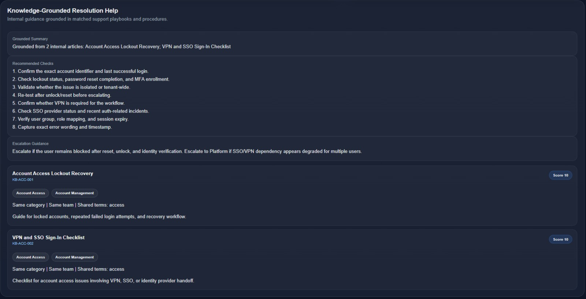

### Ticket History Summary
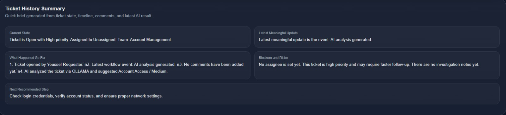

### Feedback Capture
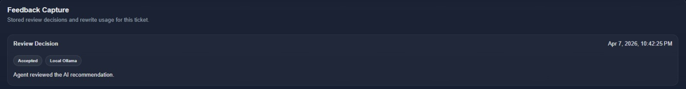

### Ticket Actions and Similar Tickets
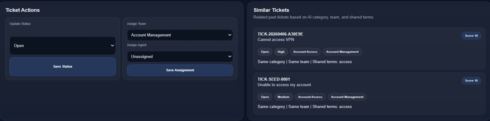

### Comments Workspace and Event Timeline
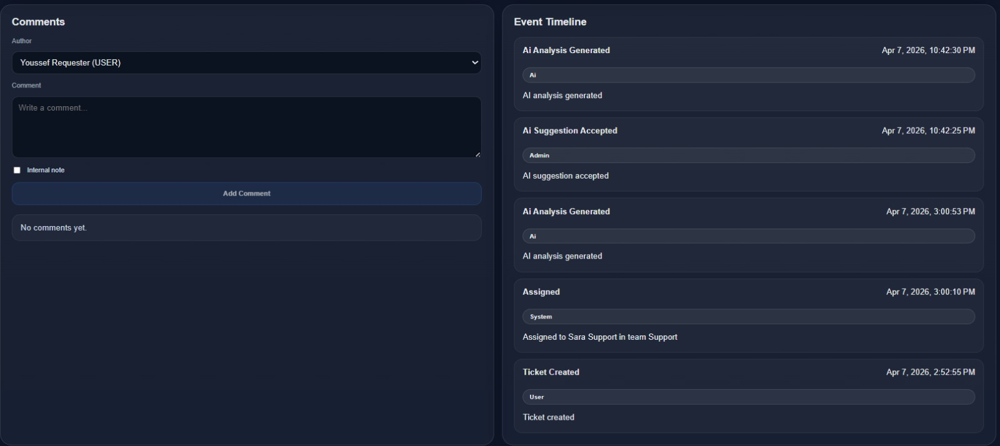

## Architecture

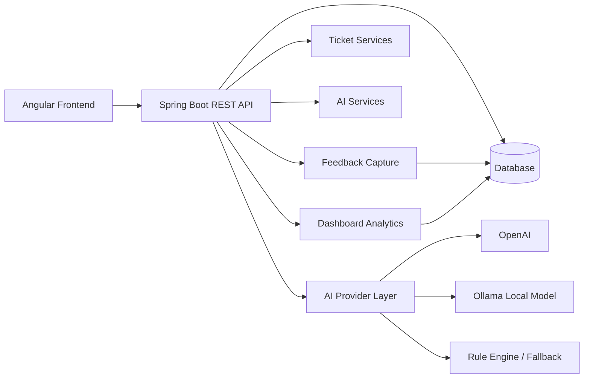

---

## Architecture summary

### Frontend

The frontend is built with **Angular** and provides:

* dashboard
* ticket queue
* ticket detail workspace
* reactive forms
* reusable API service layer
* toast notifications
* workflow-driven UI states

### Backend

The backend is built with **Spring Boot** and exposes REST endpoints for:

* tickets
* status updates
* assignment
* comments
* events
* AI recommendations
* rewrite tools
* knowledge guidance
* history summary
* feedback capture
* dashboard analytics

### Persistence

The domain model is persisted through a repository layer and structured around real support entities.

### AI integration layer

The AI subsystem is provider-aware and can work with:

* OpenAI
* local Ollama models
* rule-based fallback logic

This flexibility was an intentional design choice to support cost control, local experimentation, and resilient degraded-mode behavior.

---

## Domain model

Core entities include:

* **Ticket**
* **TicketComment**
* **TicketEvent**
* **AIRecommendation**
* **AIFeedbackEvent**
* **Team**
* **User**

These entities allow the app to model both support workflow and AI workflow in a structured way.

---

## AI design decisions

## Human-in-the-loop by design

AI suggestions are reviewable before being acted on. The product deliberately avoids silent automation in core support decisions.

## Visible source attribution

Users can see whether a result came from a local model, a hosted provider, or a fallback path.

## Confidence is part of the workflow

Confidence is surfaced to the UI so agents can interpret suggestions appropriately instead of treating all outputs equally.

## Safe degradation matters

The system remains usable even when model quality drops or a provider is unavailable.

## AI should be measurable

Feedback capture and AI dashboard metrics ensure that the system can evaluate AI usefulness over time.

These decisions reflect a product mindset focused on trust, control, and operational reality.

---

## Technical highlights

This project demonstrates experience with:

* Angular application structure and component-driven UI
* Spring Boot REST API design
* service/repository architecture
* DTO-based response modeling
* provider-aware AI integration
* local model experimentation with Ollama
* rule-based fallback systems
* workflow state modeling
* audit trail design
* metrics-oriented product thinking
* frontend/backend contract evolution under active feature growth

---

## Challenges solved

Building this project involved more than styling screens.

Some of the real engineering challenges included:

* keeping frontend and backend contracts aligned as the app evolved
* integrating multiple AI provider modes cleanly
* making AI output safe enough for workflow use
* preserving UX clarity on a dense ticket detail page
* storing AI-related feedback as real product data
* turning AI usage into dashboard-level metrics
* handling fallback behavior without breaking user trust

These are the kinds of problems that make workflow products interesting to build.

---

## Demo flow

A strong demo path for this project is:

1. Open the dashboard
2. Review ticket KPIs and AI analytics
3. Open the ticket queue
4. Search or filter tickets
5. Open a ticket detail page
6. Run AI analysis
7. Review the AI summary and draft reply
8. Use a rewrite tool
9. Inspect grounded guidance and similar tickets
10. Accept or reject the AI recommendation
11. Review feedback capture
12. Return to the dashboard and observe analytics changes

This flow shows the full lifecycle from operational intake to AI measurement.

---

## Tech stack

### Frontend

* Angular
* TypeScript
* Reactive Forms
* Router
* Component-based UI architecture

### Backend

* Spring Boot
* Java
* Spring Web
* Spring Data JPA

### AI

* OpenAI integration
* Ollama local model integration
* rule-based fallback logic

### Persistence

* relational database via JPA repositories

---

## Running locally

> Adjust commands if your local folder names differ.

### Backend

```bash
cd helpdesk-backend
./mvnw spring-boot:run
```

### Frontend

```bash
cd helpdesk-frontend
npx ng serve --proxy-config proxy.conf.json --open
```

### Optional local AI provider

Run Ollama locally and point the backend to a supported model if you want local AI behavior.

Example environment variables:

```bash
HELPDESK_AI_PROVIDER=ollama
OLLAMA_MODEL=qwen2.5:7b-instruct
```

For hosted-provider usage:

```bash
HELPDESK_AI_PROVIDER=openai
OPENAI_API_KEY=your_key_here
OPENAI_MODEL=your_model_here
```

The system is designed to remain usable with fallback behavior when provider output is unavailable or unsuitable.

---

## Future improvements

Planned or possible next steps include:

* semantic similar-ticket matching using embeddings and vector search
* richer AI trend visualizations on the dashboard
* stronger auth and role enforcement
* larger internal knowledge base for grounding
* attachment support
* SLA tracking
* notification workflows
* evaluation views for comparing providers and acceptance outcomes over time

---

## What this project demonstrates

This project demonstrates more than the ability to build a CRUD interface.

It shows the ability to:

* design a full workflow product
* model a realistic support domain
* integrate AI responsibly into operations
* expose human control over AI recommendations
* capture feedback as structured product data
* measure AI behavior with operational analytics
* present the result as a coherent system rather than a collection of disconnected pages

---

## Final takeaway

**AI Helpdesk Copilot** was built to show what happens when a standard workflow product is extended with AI in a disciplined way.

Instead of treating AI as decoration, this project treats it as a governed operational layer:

* useful to agents
* visible to reviewers
* grounded in workflow
* resilient under fallback
* measurable over time

That combination is what makes the project feel like a real product and not just a demo.

---

## Author

Built by **Mountadem Badr** as a portfolio project focused on workflow product design, AI-assisted operations, and measurable human-in-the-loop support tooling.
